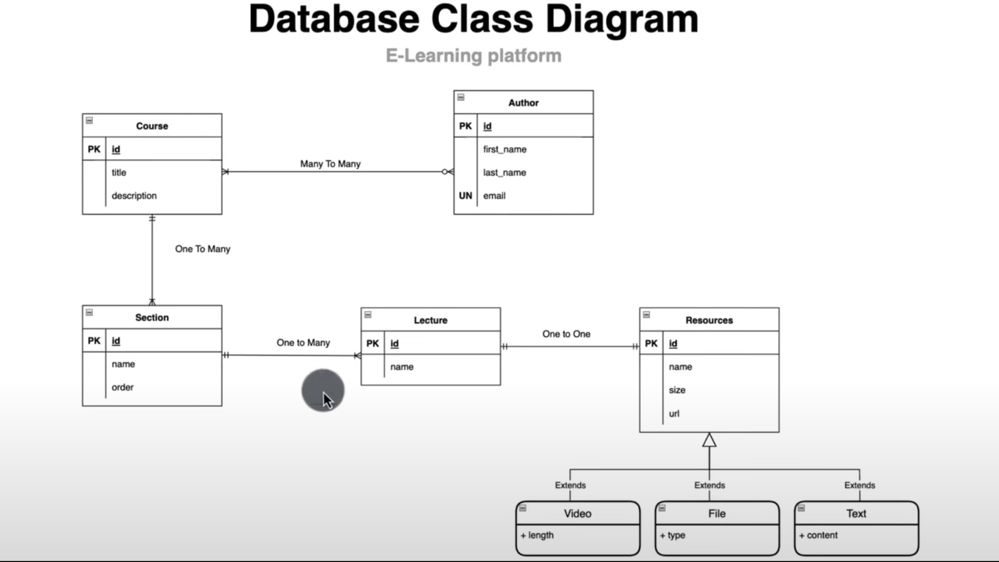

# Spring Data JPA

This repository contains my work and notes from the Spring Data JPA Course. The course focuses on teaching the essentials and advanced features of Spring Data JPA, a framework that simplifies data access in Java applications

## Database Class Diagram
